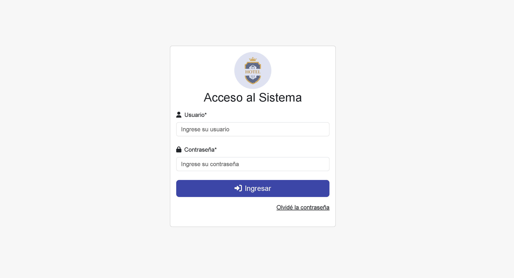
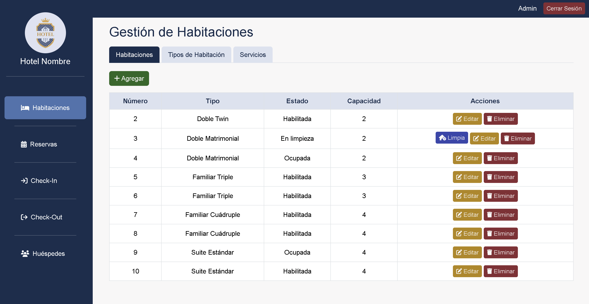
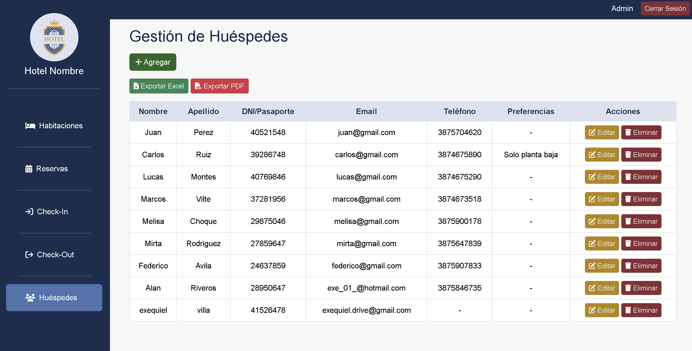
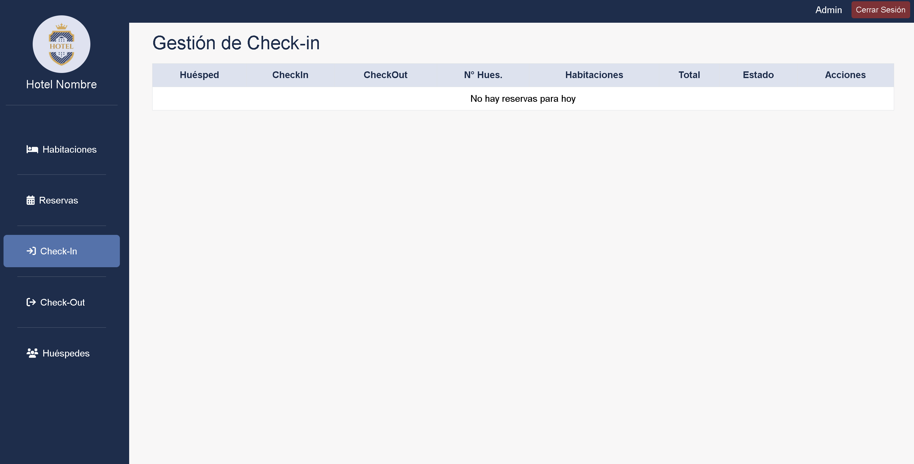
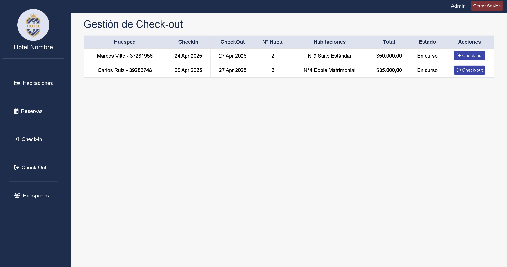
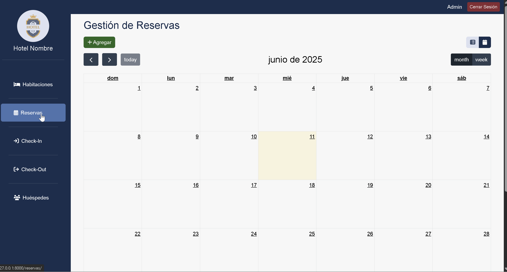

# Hotel Boutique - Sistema de gestión interna
Este trabajo fue desarrollado como proyecto personal con el objetivo de poner en práctica tecnologías de desarrollo web (Python con Djando, Javascript, HTML, CSS y boostrap).  
Corresponde a un sistema de gestion interna de un hotel boutique, incluyendo módulos para reservas, check-in, check-out, habitaciones y usuarios.

## 📸 Capturas de pantalla

### Inicio de sesión

### TAB Habitaciones y Tipo de Habitaciones

### Modulo de Huéspedes

### Modulo de Reservas

### Formulario registrar reserva

### Modulo de Check-In 

### Modulo de CheckOut

## DEMO

## ⚙️ Tecnologías usadas
- Python 3
- Django
- JavaScript
- HTML
- CSS
- Bootstrap
- SQLite
